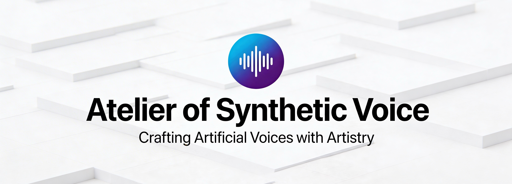

# Atelier of Synthetic Voice



A professional desktop application for high-fidelity voice cloning and TTS synthesis, powered by **Qwen3-TTS-12Hz-1.7B-Base**. Exclusively designed and optimized for **macOS** and **Windows**, with native **Apple Silicon (MPS)** and **NVIDIA (CUDA)** acceleration.

## 🌟 Key Features

### 🎙️ Voice Lab

Create reusable high-fidelity voice profiles.

- **Auto-Transcription:** Integrated **Whisper** support to automatically transcribe your reference audio.
- **Profile Management:** Organize your voices with custom metadata, languages, and preview snippets.
- **Multi-File Support:** Merge multiple short clips into a single, high-quality reference signature.

### 🎭 Speech Studio

The heart of generation.

- **One-Click Synthesis:** Generate speech from text using your saved voice profiles.
- **Advanced Controls:** Fine-tune the voice with real-time parameters (Temperature, Repetition Penalty, Sub-talker Temperature).
- **Export Management:** Automatically save and organize all your generated speech into structured exports.

### 🕵️ Audio Extractor (Data Miner)

Expertly harvest perfect voice clips from long, noisy media files.

- **AI-Powered Labeling:** Integrates **Gemini 2.5 Flash** for "extremely critical" emotion and quality assessment.
- **Speaker Verification:** Uses **SpeechBrain (ECAPA-TDNN)** to ensure extracted clips only belong to your target speaker.
- **Voice Activity Detection:** Powered by **Silero VAD** for millisecond-precision audio segmenting.
- **Expressive Focus:** Optimized to find vivid emotions (angry, excited, happy, whispering) while filtering out neutral or low-quality noise.

### ⚙️ System Settings

Complete control over the synthetic engine and application behavior.

- **Model Preloading:** Warm up the 1.7B parameter model for instant generation.
- **Dynamic Parameters:** Adjust `max_tokens`, `temperature`, and `penalty` globally.
- **API Integration:** Securely manage your Gemini API key for advanced audio analysis.

## 🛠️ Requirements

- **macOS 14.0+** (Apple Silicon M1/M2/M3 recommended) or **Windows 10/11**.
- **Python 3.12+** (3.14 recommended for optimized performance).
- **FFmpeg:** Essential for audio processing (automatically handled by setup on macOS).
- **Gemini API Key:** Optional, required for the advanced "Audio Extractor" labels.

## 🚀 Installation & Launch

The project utilizes **uv** (the fastest Python package manager) and **just** for a seamless, isolated setup.

### macOS (Recommended)

```bash
# 1. Clone the repository and enter it
cd voice-clone

# 2. Run the expert setup (installs uv, just, ffmpeg, and creates the venv)
chmod +x setup.sh launch.sh
./setup.sh

# 3. Launch the application
./launch.sh
```

### Windows

1. Install [Python 3.12+](https://www.python.org/downloads/) and [FFmpeg](https://ffmpeg.org/).
2. Run the following in your terminal:

```powershell
pip install uv
uv venv --python 3.14
.\.venv\Scripts\activate
uv pip install -r requirements.txt
python main.py
```

## 📂 Project Structure

```text
voice-clone/
├── main.py               # Application entrypoint
├── requirements.txt      # Dependency manifest
├── setup.sh / launch.sh  # Expert automation scripts
├── core/
│   ├── engine.py         # TTS Engine (MPS/CUDA Optimized)
│   ├── profiles.py       # Voice Profile CRUD & Storage
│   └── extractor.py      # AI-Powered Audio Mining Pipeline & VAD
├── ui/
│   └── flet_app.py       # Modern, scrollable Flet UI
└── voices/               # Local database (Profiles, Settings, Exports)
```

## 🚄 Performance Optimization

| Feature                  | Backend                    | Optimized For                     |
| ------------------------ | -------------------------- | --------------------------------- |
| **TTS Generation**       | `torch.mps` / `torch.cuda` | Instant inference via Metal/CUDA  |
| **Speaker Verification** | `ECAPA-TDNN`               | High-precision voice matching     |
| **Audio Processing**     | `soundfile` / `scipy`      | 16/22kHz high-fidelity throughput |
| **Memory**               | `bfloat16`                 | Optimized 1.7B model footprint    |

## ⚖️ License

Private Project - All Rights Reserved. Designed for the Art of Synthetic Voice.
